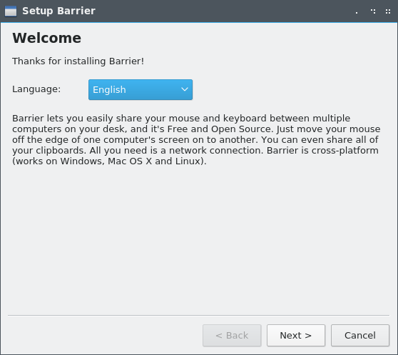
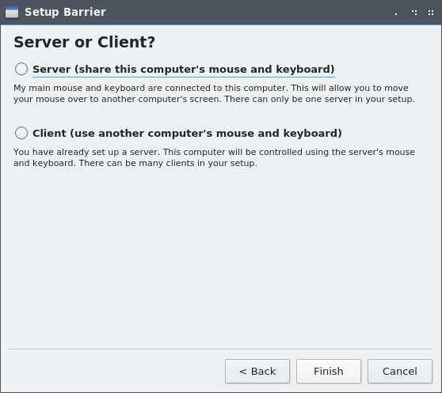
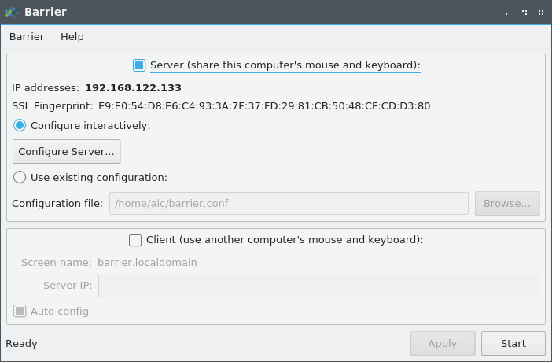

The initial setup of barrier is universal across all platforms, it involves a
few easy steps.

1. Launch barrier
2. Choose your language 
3. Press the `Next` button
4. Choose wether the computer will be a `server` or `client`. 
5. Press the `Finish` button

Initial setup is now done, and barrier should have launched.

